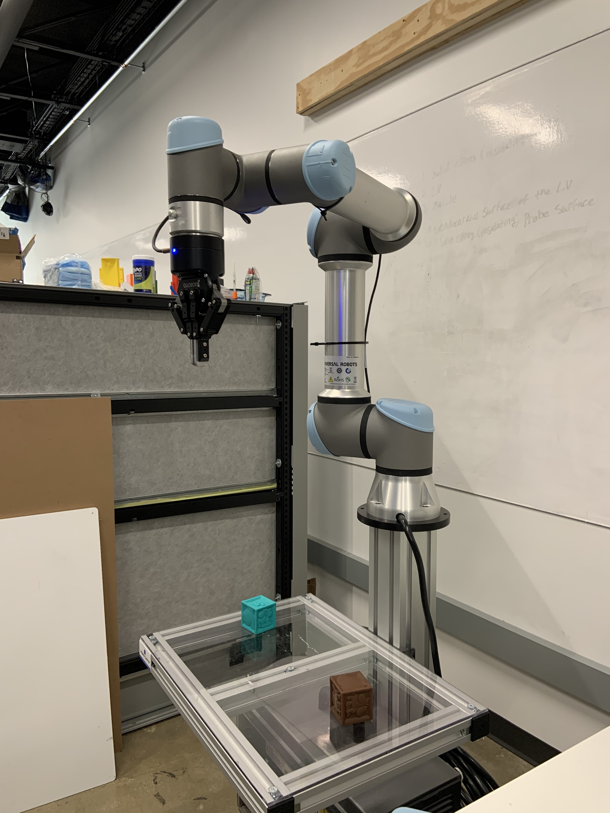
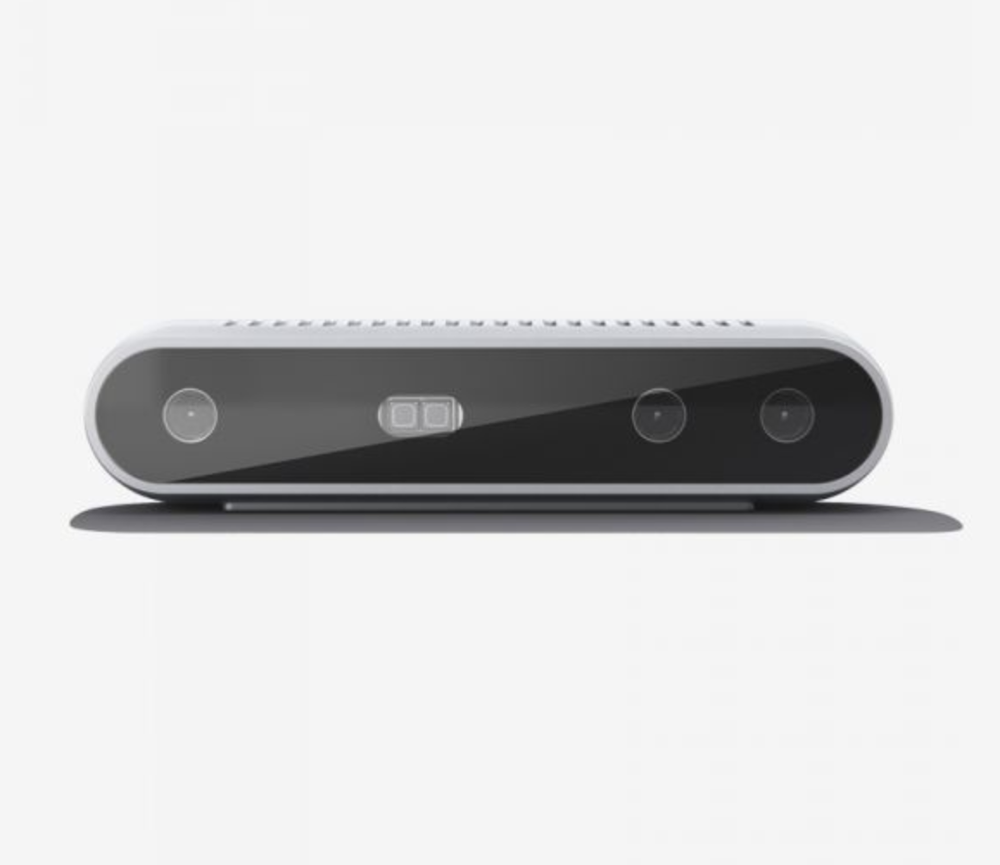
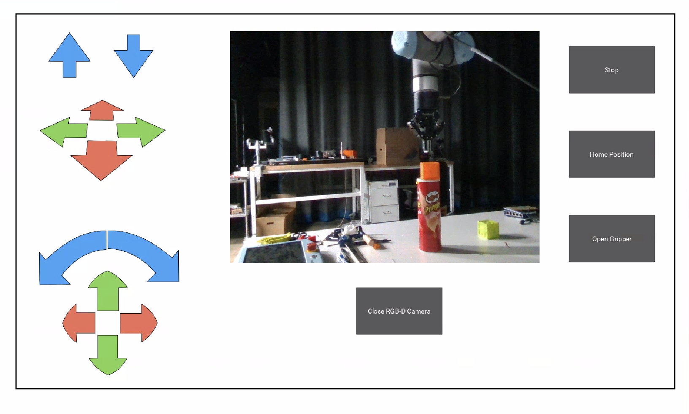

# Fine Tune Remote Control of a Robotic Arm

This project develops a human-robot system that consists of an RGB-D camera, a robotic arm, and a Graphical User Interface (GUI). The most important feature of the system is the waypoint control function that enables a human operator to command the robotic arm to approach a target location by directly clicking on the corresponding pixel in a camera view. 


## UR5e Robotic Arm



In the backend, the connection, movement and rotation of the robotic arm is controlled by ``urx``, a python library to control the robots from Universal Robots: https://github.com/SintefManufacturing/python-urx.

To install ``urx``, our project uses this fork of package:
https://github.com/jkur/python-urx/tree/SW3.5/urx. If you use pip to install ``urx``, you may get such an issue: https://github.com/SintefManufacturing/python-urx/issues/64.

## Intel Realsense D415



The connection, image data transmission between the RGB-D camera and the computer, and pixel deprojection are supported by ``pyrealsense2``, an official Python wrapper that works with RealSense SDK 2.0. For more information about ``pyrealsense2`` installation and APIs, please refer to: https://github.com/IntelRealSense/librealsense/tree/master/wrappers/python. 


## Interface



The interface uses multiple threads to communicate with both the RGB-D camera and robotic arm: one thread runs in the background, handling incoming data packets from the camera, while the other threads build the connection and send commands to the robotic arm.

As shown below, the interface displays a camera view, which covers the workspace of the robotic arm. If a pixel is clicked, the end point of the gripper will move to the corresponding 3D location. Note: if the target location is out of the safe range of the robotic arm, the robotic arm will keep moving until the protection stop is triggered. In addition, two sets of arrow buttons on the left provide nudge control for users to move and rotate the robotic arm on a small scale. Moreover, three rectangular grey buttons on the right provides some extra functions: (1) stop the robotic arm from futher moving; (2) move the robotic arm to the home position; (3) open and close the gripper. 

The interface is developed in ``Kivy``, a Python library for development of applications that make use of user interfaces. For more information about ``Kivy`` installation and APIs, please refer to: https://kivy.org/#home.

Run the interface:
```sh
python interface.py
```
Note: before running the interface, both the UR5e robotic arm and the Intel Realsense D415 RGB-D camera should be turned on and connected to the computer.


## Coordinate Transformation

In order to map any point in the coordinate system of the depth camera to the corresponding point in the coordinate system of the robotic arm, we need to find the transformation matrix between the two coordinate systems. 

The current procesure to find the transformation matrix is divided into two steps: the first step is data collection, and the second step is about solving an optimization problem using Singular Vector Decomposition (SVD) algorithm.

For the first step, we need to collect two groups of paired data: one group contains 3D coordinates of points relative to the depth camera, and the other group contains the corresponding 3D coordinates of points relative to the robotic arm. To collect 3D points relative to the robotic arm, we can manually move the robotic arm to different locations and for each location we can run `move_urx.py` to get the current location of the end point of the gripper relative to the robotic arm. To collect 3D points relative to the depth camera, we can run `camera_cali.py`, which displays the camera view in OpenCV and we can get the 3D coordinates of the end point of the gripper relative to the depth camera by clicking on the correspoinding pixel. For better optimization, it is suggested to collect at least ten such paired data.

After collecting the data, we can get the transformation matrix by running `svd.py`. The input is two numpy arrays, and the output is a rotation vector and a translation vector.

When the calibration is done, you can run `no_interface.py` to test the accuracy of the movement of the robotic arm by clicking on a pixel in an OpenCV window, without the need to run a Kivy interface.


